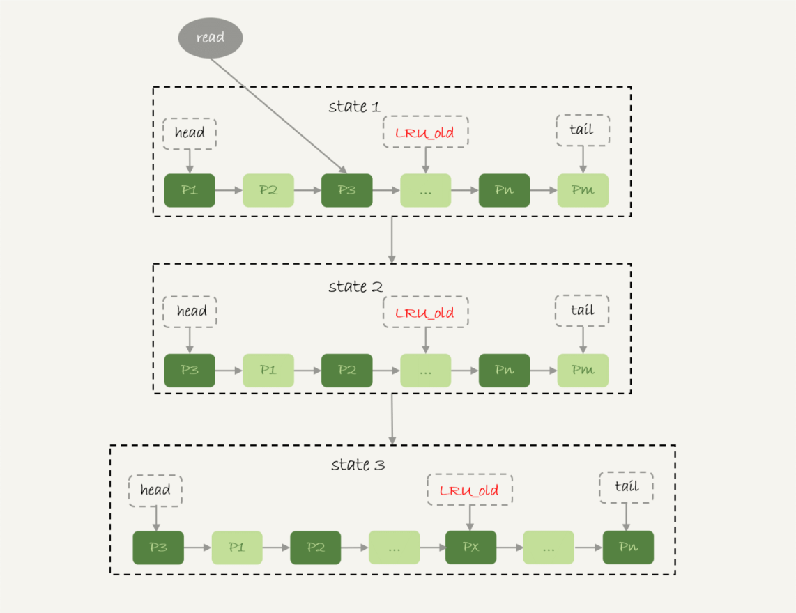
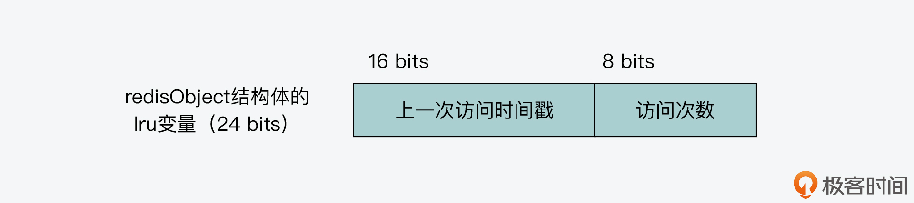
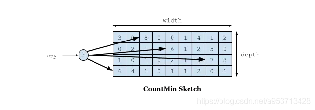
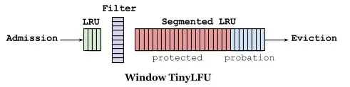

# 常见的缓存模式

## Cache aside patten


过程： 

* 读操作： 先读缓存，若缓存存在，直接返回。缓存不存在，则从DB 加载，然后写到缓存
* 写操作： 更新DB,然后删除缓存

**为什么不先更新缓存，在更新DB**。如果有两个并发写操作，将导致缓存和DB 不一致。也即 线程1 先更新缓存，线程2 后更新缓存，但是线程2更新DB 提前返回，线程1更新DB后返回导致缓存和DB 不一致。

**先更新DB 在删除缓存也有并发问题**，不过是降低了缓存不一致的概率。线程1 读取缓存，缓存不存在，然后从DB 读取数据，此时线程2 更新DB 并更新了缓存，这是线程1又把过期的数据加载到缓存了。但是实际上DB 的写操作一般比读操作慢，所以这种发生的概率较低。

>  **无法解决的问题：**
>
> 无法解决更新DB 后删除缓存失败的场景，要保证缓存DB的一致性问题只能通过2PC或Paxos 一致性协议来保证.但是对于这个2PC太慢，Paxos 太复杂，所以一般通过设置缓存的有效期，让其最终一致。
>
> 支持XA 事务的缓存有Ehcahe

### 什么又是延迟双删（常用，推荐使用）？

在更新操作的时候先删除缓存，然后再更新DB, 在延时一定的时间重新删除缓存。

先删除缓存可以保证新的进程不会读到旧的数据。**延时删除的作用是**，可以保证在更新DB过程中（更新的线程记为线程1）可能有并发读操作（记为线程2）从DB 读到了旧的数据，若没有延时直接删除，那么线程1删除了缓存，此时线程2读到的旧数据可能重新载入缓存，导致不一致。


## Read/write through patten

对比与cache aside patten, 当缓存中不存在时，需要调用方自己去DB 查询，然后加载到缓存，也即调用方需要负责缓存和DB数据。

对于read/write through patten 则认为 cache 和DB 是统一的存储。存储内部自己负责DB 和缓存的一致。


## read through

过程：

​	若缓存存在，直接返回，缓存不存在，则由缓存自己从DB 中加载数据，然后返回给调用方

## write through

过程：

​	若缓存存在，则更新缓存，又缓存将数据更新到DB。若缓存不存在，则直接更新DB,然后返回。

​	

## Write behind caching patten


write behind 又叫write back (写回)。类似于操作系统的page cache. 

过程：

读操作：若数据在缓存中，直接返回，不在缓存则从DB 加载后写入缓存，并将数据标识**非脏页**。

写操作：直接写入缓存，并将该缓存标记为**脏数据**，然后返回。

当缓存用完了，LRU 算法淘汰旧的缓存，如果发现数据是脏数据，则需要写回DB,否则直接淘汰。当系统优雅关闭，需要将脏数据写回DB.若宕机，则有数据丢失的风险。


#  缓存策略

* LRU(Lease Rencently Used)：最近最少使用,淘汰最久未使用的数据(***基于访问时间***)

  解决方案：链表（处理新老关系）+哈希（处理查询）

* LFU(Lease Frequently Used)：使用频率最少,淘汰访问频率最少的数据（***基于访问次数***）

  解决方案：堆排序（处理频率排序）+哈希（处理查询）

## 分别适用什么场景

* LRU :适用于最近被访问的数据在将来很有可能被再次访问的假设。针对突发流量，可以很好缓存数据对外服务，也不需要统计频率数据（LFU需要），**缺点它可能会将之前的热点数据（高频的数据）淘汰，导致缓存命中率下降，也即缓存污染**。
* LFU:只要数据访问模式的概率分布随时间保持不变，其命中率就会非常高。哪怕有突发的大量冷门数据访问，也不会将原高频数据淘汰，**缺点就是新的热点数据无法很好的缓存，老的热点数据无法淘汰**

# 什么是缓存雪崩/穿透/击穿

* **缓存雪崩**:大量数据无法再缓存中找到，导致请求发送到DB,DB压力激增
  * 缓存数据同时过期（设置了相同的过期时间。修改缓存的过期时间，增加1~3min 随机值；或者服务降级，针对核心数据，继续查DB,非核心数据返回空值或预定义数据）
  * 缓存集群故障（redis 故障。设置服务熔断或前端限流，保障数据库正常运行；这就需要应用监听redis负载情况，如CPU，QPS，内存使用率等；做好redis 集群的高可用，如使用sentinel机制）

* **缓存击穿**: 某些频繁访问的热点数据，无法再缓存中处理，从而发送到DB,导致DB压力变大
  * 热点数据不要设置过期时间
* **缓存穿透**：数据既不在缓存，也不在DB。**缓存空值；或使用布隆过滤器；前端参数合法性校验**
  * 业务误操作
  * 恶意攻击

# Mysql buffer pool 的缓存设计

若MySQL采用原始原始的LRU 算法，那么若一条SQL 扫描了一张大表，将导致，缓存中的热点数据全部被淘汰掉，是缓存命中率下降，我们来看看Innodb是如何改进LRU 算法。



在Innodb中将LRU 链表分为yong 区(5/8)和 old 区（3/8）,其中用去靠近链表头部，如上图所示。尾部是old 区。

* 若访问 yong区数据页，则将其移动到链表头部

* 若访问不存在的数据也，则淘汰pm(链表尾部)数据页，并将新的数据放入LRU_old处
* 若再次访问old区数据时，
  * 若数据在链表中超过1s,则移到链表头部
  * 如小于1s,则保持不变

这样就可以保证在大表扫描时，由于数据在old 区域，没有机会进入yong区，不会污染缓存

# Redis 淘汰策略

redis 可以设置最大的内存容量`maxmemory`,当超过最大内存时，通过`maxmemory-policy`淘汰策略来淘汰数据，腾出新的空间给新的数据。其中有`allkeys-lru`和`volatile-lru`使用LRU 算法，有`allkeys-lfu`和`volatile-lfu`使用LFU 算法,下面介绍下在redis中如何使用这两种策略

* LRU

我们知道redis中每个键值对的值都是redis Object,它上面有个lru变量24bit,LRU 策略会在上面记录上次的访问时间戳

* LFU

当我们需要记录频率，不能简单的通过访问次数来统计，需要用时间+次数的方式来统计频率。redisObject上面有个lru变量24bit，在LRU策略中是记录上次使用的时间戳。由于LFU是redis 4.0 引入的，故其复用了这个lru变量，其中16bit(精确到分钟) 记录上次访问时间戳，后8bit（初始值5,如果这里取值0,很可能马上就被淘汰掉，也就是让它存活一段时间）记录人访问次数。



1. 根据上次的访问时长，衰减访问次数. 

   如原本0-5分钟访问10次，那么freq=2次/分钟，后5-10分钟没有访问，在10-15分钟访问，需要将原来的freq 衰减为1次/分钟。**在默认情况下（lfu_decay_time控制），访问次数的衰减大小就是等于上一次访问距离当前的分钟数**（若访问次数已经为0 ，不衰减）

2. 根据当前的访问更新访问次数

   由于访问次数最大255，若已经是最大值，则不更新。

   其实redis 不是每次访问值就直接将访问次数加一，这样255上限就太小了。所以它的策略是，访问一定的次数，才将访问次数加一。相当于将实际记录的访问次数范围变大了。

   计算时会计算一个阈值 p，以及一个取值为 0 到 1 之间的随机概率值 r。如果概率 r 小于阈值 p，那么 才会将访问次数加 1。否则的话，访问次数不变。而阈值 p 的值大小，其实是由两个因素决定的。一个是当前访问次数和宏定义 LFU_INIT_VAL 的差值 baseval，另一个是 redis.conf 文件中定义的配置项 lfu-log-factor。

   > r=random(0~1)
   >
   > p =1/(baseval * lfu-log-factor+1)
   >
   > 若r<p,访问次数加一，否则访问次数不变
   >
   > baseval 反映了访问多少次，当访问很多次后，在增加他的至难度会变大；
   >
   > Lfu-log-factor 反映了访问次数的增加难度，越大难度越高，也即 访问次数实际表示的访问频率越高

   

   可以看到lfu-log-factor 在取值为10时，访问频率255实际可以表示1M 的访问频率。

3. 更新lru变量

* LRU和LFU实际的淘汰做法

  redis 淘汰数据并不是针对全部的数据进行淘汰，不然针对LRU需要很大空间，通过链表维护访问时间前后关系，而针对LFU 需要很多的空间来维护访问频率的排序。所以redis 采用的是随机采用的方式，随机一部分数据，数量由`maxmemory-samples`配置，放入`EvictionPoolLRU`,然后计算idle ,将idle 越大的优先淘汰。针对LRU ,上次访问时间越早，idle 越大，越容易淘汰；针对LFU,访问频率越低，idle 越大，越容易淘汰。淘汰最大idle 的数据后，然后循环将采用数据放入`EvictionPoolLRU`,不断淘汰pool 中的数据，知道满足我们的最大内存限制。

  ```c
  if (server.maxmemory_policy & MAXMEMORY_FLAG_LRU) { 
    idle = estimateObjectIdleTime(o);
  } else if (server.maxmemory_policy & MAXMEMORY_FLAG_LFU) {
    idle = 255-LFUDecrAndReturn(o);
  }
  ```

# Caffine cache (W-tinyLFU)

Caffine cache 是一个高性能的Java 本地缓存组件，基于guava cache,并优化算法为`Window-TinyLFU`,`W-TinyLFU`中使用Count-Min Sketch记录我们的访问频率，它是一种类 布隆过滤器的思想，可以降低频率信息的内存损耗



存储数据时，对key进行多次 hash 函数运算后，二维数组不同位置存储频率（Caffeine 实际实现的时候是用一维 long 型数组，每个 long 型数字切分成16份，每份4bit，默认15次为最高访问频率，每个key实际 hash 了四次，落在不同 long 型数字的16份中某个位置）。读取某个key的访问次数时，会比较所有位置上的频率值，取最小值返回。对于所有key的访问频率之和有个最大值，当达到最大值时，会进行reset即对各个缓存key的频率除以2。



如下图缓存访问频率存储主要分为两大部分，即 LRU 和 Segmented LRU 。新访问的数据会进入第一个 LRU，在 Caffeine 里叫 WindowDeque。当 WindowDeque 满时，会进入 Segmented LRU 中的 ProbationDeque，在后续被访问到时，它会被提升到 ProtectedDeque。当 ProtectedDeque 满时，会有数据降级到 ProbationDeque 。数据需要淘汰的时候，对 ProbationDeque 中的数据进行淘汰。具体淘汰机制：取ProbationDeque 中的队首和队尾进行 PK，队首数据是最先进入队列的，称为受害者，队尾的数据称为攻击者，比较两者 频率大小，大胜小汰。

所以caffine cache 其实是结合了LRU 和LFU 算法进行内存淘汰

# 参考文献

1. [缓存的更新套路](https://coolshell.cn/articles/17416.html)
2. [极客时间 MySQL实战45讲](https://time.geekbang.org/column/article/79407)
3. [极客时间 Redis核心技术与实战](https://time.geekbang.org/column/article/296586)
4. [高性能缓存 Caffeine 原理及实战](https://zhuanlan.zhihu.com/p/348695568)
5. [Caffeine Cache-高性能Java本地缓存组件](https://www.cnblogs.com/rickiyang/p/11074158.html)

