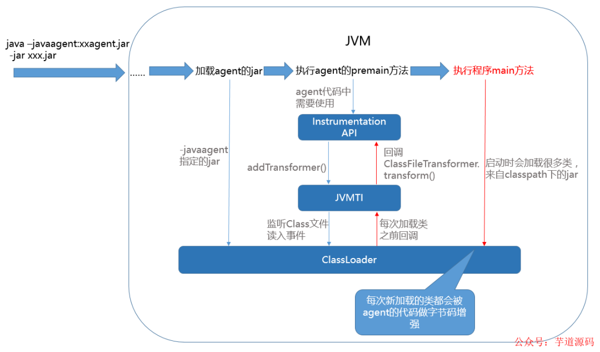

# 双亲委派模型

## 有哪些类加载器

- Bootstrap ClassLoader ，主要负责加载Java核心类库，%JRE_HOME%\lib下的rt.jar、resources.jar、charsets.jar和class等。
- Extention ClassLoader，主要负责加载目录%JRE_HOME%\lib\ext目录下的jar包和class文件。
- Application ClassLoader ，主要负责加载当前应用的classpath下的所有类
- User ClassLoader ， 用户自定义的类加载器,可加载指定路径的class文件

## 为什么需要双亲委派？

1. **避免类的重复加载**：当父加载器已经加载过某一个类时，子加载器就不会再重新加载这个类。

2. **保证了安全性**：因为Bootstrap ClassLoader在加载的时候，只会加载JAVA_HOME中的jar包里面的类，如java.lang.Integer，那么这个类是不会被随意替换的

## 双亲委派被破坏的例子

双亲委派机制的破坏不是什么稀奇的事情，很多框架、容器等都会破坏这种机制来实现某些功能。

1. 在双亲委派出现之前

由于双亲委派模型是在JDK1.2之后才被引入的，而在这之前已经有用户自定义类加载器在用了。所以，这些是没有遵守双亲委派原则的。

2. JNDI、JDBC等需要加载SPI接口实现类的情况

   **DriverManager是被根加载器加载的，那么在加载时遇到以上代码，会尝试加载所有Driver的实现类，但是这些实现类基本都是第三方提供的，根据双亲委派原则，第三方的类不能被根加载器加载。**

   那么，怎么解决这个问题呢？

   于是，就**在JDBC中通过引入ThreadContextClassLoader（线程上下文加载器，默认情况下是AppClassLoader）的方式破坏了双亲委派原则。**

3. 实现热插拔热部署工具：为了让代码动态生效而无需重启，实现方式时把模块连同类加载器一起换掉就实现了代码的热替换。

4. tomcat等web容器的出现.

   **如果采用默认的双亲委派类加载机制，那么是无法加载多个相同的类。**

   所以，**Tomcat破坏双亲委派原则，提供隔离的机制，为每个web容器单独提供一个WebAppClassLoader加载器。**

   Tomcat的类加载机制：为了实现隔离性，优先加载 Web 应用自己定义的类，所以没有遵照双亲委派的约定，每一个应用自己的类加载器——WebAppClassLoader负责加载本身的目录下的class文件，加载不到时再交给CommonClassLoader加载，这和双亲委派刚好相反。

5. OSGI、Jigsaw等模块化技术的应用:


## Java agent

Java Agent 是在 Java 应用程序运行时期间动态地附加或注入到 Java 虚拟机（JVM）进程中的一段 Java 程序。Java Agent 可以以某种方式修改或增强 Java 应用程序的行为，例如监视或分析应用程序，或者向应用程序注入额外的代码以实现跟踪、调试或性能分析。


Java Agent 的主要特点包括：动态附加到运行中的 Java 应用程序；能够拦截、修改或替换 Java 应用程序中的类、方法、变量等元素；可以访问和监视应用程序的 JVM 内部状态和性能数据等。

## Java agent 代理入口

 jar 文件的manifest 需要指定agent 全限定类名，根据启动实际不同可以选择不同改的方式，以下二选一

```java
// 用于JVM刚启动时调用，其执行时应用类文件还未加载到JVM
public static void premain(String agentArgs, Instrumentation inst);
 
// 用于JVM启动后，在运行时刻加载
public static void agentmain(String agentArgs, Instrumentation inst);
```

Instrumentation接口定义

```java
public interface Instrumentation {
    /**
     * 注册一个Transformer，从此之后的类加载都会被Transformer拦截。
     * Transformer可以直接对类的字节码byte[]进行修改
     */
    void addTransformer(ClassFileTransformer transformer);
    
    /**
     * 对JVM已经加载的类重新触发类加载。使用的就是上面注册的Transformer。
     * retransformation可以修改方法体，但是不能变更方法签名、增加和删除方法/类的成员属性
     */
    void retransformClasses(Class<?>... classes) throws UnmodifiableClassException;
    
    /**
     * 获取一个对象的大小
     */
    long getObjectSize(Object objectToSize);
    
    /**
     * 将一个jar加入到bootstrap classloader的 classpath里
     */
    void appendToBootstrapClassLoaderSearch(JarFile jarfile);
    
    /**
     * 获取当前被JVM加载的所有类对象
     */
    Class[] getAllLoadedClasses();
}
//ClassFileTransformer接口，定义如下：
/**
 * 传入参数表示一个即将被加载的类，包括了classloader，classname和字节码byte[]
 * 返回值为需要被修改后的字节码byte[]
 */
byte[]
transform(  ClassLoader         loader,
            String              className,
            Class<?>            classBeingRedefined,
            ProtectionDomain    protectionDomain,
            byte[]              classfileBuffer)  throws IllegalClassFormatException;
```

manifest 例子：

```properties
Manifest-Version: 1.0
Can-Redefine-Classes: true
Class-Path: javassist-3.27.0-GA.jar postgresql-42.3.1.jar checker-qual-3.5.0.jar
Can-Set-Native-Method-Prefix: true
Premain-Class: com.congge.agent.MyPreMainAgent
Can-Retransform-Classes: true

 
```

## 加载方式

- 启动时加载：通过vm的启动参数-javaagent:**.jar来启动
- 启动后加载：在vm启动后的任何时间点，通过attach api，动态地启动agent




参考：

https://cloud.tencent.com/developer/article/1950546

https://blog.csdn.net/zhangcongyi420/article/details/128162591