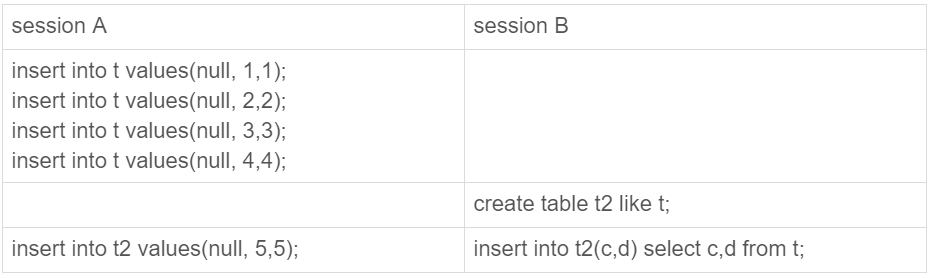

# 日志系统

## redo log&bin log

* redo log 属于引擎层 是物理日志，记录在那一页修改了啥，底层由四个文件循环写入
* bin log  数据server 层，是逻辑日志. 记录 SQL或statement. 是追加写入，用于备份或主从同步

## 两阶段提交

redo log prepare( 数据落盘) -->write bin log  --> coimmit binlog

Crash safe 处理：

1. 若在write bin log 之前 crash, 机器恢复时会回滚redo log,保证主从一致
2. 若在 write bin log 之后crash ,机器恢复时会提交redo log,因为主从同步是以bin log 为准，要保证主从一致需要提交redo log

# 事务的隔离性

## 隔离级别

* 读未提交
* 读已提交
* 可重复读
* 串行化


读数据有：**当前读**(select .. for update/ lock in share/write mode)或**快照读**（普通select）

**当前读 **通过加锁机制保证隔离性

**快照读** 通过 read view 保证隔离性。每个row隐藏有两个列，一个trxid 和 rollback_ptr ,通过不断回滚（执行undo log）回滚到之前版版本，从而保证在事务内，可重复读。

备注： 如果有长事务操作数据，将导致该行数据需要不断回滚才能读到对应版本的数据

```select * from information_schema.innodb_trx where TIME_TO_SEC(timediff(now(),trx_started))>60```


# 索引

* 主键索引（聚簇索引）
* 二级索引（辅助索引）

主键不应太大，不然会导致二级索引的叶子节点太大，从而占用的空间也变大

## 覆盖索引

索引包含查询的全部字段，不需要二次回表（回主键索引查询）查询其他字段信息，这也是不推荐select * 的原因之一

## 最左前缀

若索引idx(a,b,c) ，则 

* where a=**  ，where a=** and b=** ，where a=** and b=**  and  c=** 可以使用索引
* where a=**  and b=**  order by c 可以使用索引

## 索引下推 Index push down

``` sql
select * from tuser where name like '张%' and age=10 and ismale=1;
```

假如 tuser  有普通索引KEY `name_age` (`name`,`age`) ，5.6之前，只能使用 name 在引擎层过滤数据后返回server 层，导致很多age 不等于10的数据也返回，5.6 版本的索引下推，可以使得在引擎层过滤不满足的条件，减少回表次数

# 锁

* 全局锁：Flush tables with read lock (FTWRL) ，仅适合全库逻辑备份。若RR隔离级别，可以用mysqldump 使用参数–single-transaction 的时候，导数据之前就会启动一个事务，来确保拿到一致性视图，避免全局锁
* 表级锁
  * 表锁: lock tables … read/write
  * 元数据锁 MDL : 执行DDL是需要先获得MDL写锁。DML 则需要获得MDL 读锁， 所以DML 和DDL 是互斥


备注：若一个长事务执行DML ，导致DDL 阻塞，会导致DDL 之后进来的DML 也阻塞（由于DDL 在排队拿MDL 写锁，导致他们拿不到MDL 读锁），所以给小表加字段，建议innodb_trx 中查找长事务，然后kill。 或者先暂停DDL

5.6 online DDL 过程：

1. 拿MDL写锁 
2.  降级成MDL读锁 
3.  真正做DDL 
4.  升级成MDL写锁 
5.  释放MDL锁

整整DDL 耗时比较就在第3步，所以在DDL 大部分时间内可以正常执行DML

 

# 分库分表

### 何时分库分表

* 磁盘IO瓶颈（适合分库）
* 连接数太多，QPS 太高，网络带宽不够（适合分库）
* 单表数据量太大（超过5000W行/复杂表1000W建议分表，否则聚簇索引树太高，读写时延增加，DDL 耗时太久等问题）

## 分库分表类型

### 1. 水平分库

场景：数据库IO,CPU压力太大

路由策略：**range**, **hash** ,**映射**  等方式将一个库数据拆分到多个库

* 库结构一样
* 数据没有交集
* 合并数据后是全量数据

解决：减低了数据库的IO和CPU 负载

### 2. 水平分表

场景：表数据量太大

路由策略：range, hash ,映射等方式将一个表数据拆分到多个表

* 表结构一样
* 数据没有交集
* 合并数据后是全量数据

解决：解决单表数据量太大问题，提高SQL 执行效率

### 3.垂直分库（业务分库）

场景：将不同表拆分到不同的数据库，如用户表拆到用户库，订单表拆到订单库。此时每个库可以有独立的微服务。

*  每个库结构不一样
* 每个库数据不一样
* 所有库的并集是全量数据

### 4.垂直分表

场景: 大表，也即一个表很多字段，部分字段是活跃数据，部分数据冷数据，可以垂直拆分主表和扩展表

* 每个表结构不一样
* 每个表有个主键用于关联主表和扩展表
* 所有表的数据是全量数据

## 分库分表引入哪些问题？

1. join 问题（可以用分库分表中间件解决，也可以在业务代码中做聚合）
2. count 问题（可以用单独的表记录，定期修正该数据）
3. 跨数据库事务问题（XA事务，或分布式事务解决方案，如seata）
4. 成本问题

## 分库分表中间件？

一般中间件有两种方式，一种客户端或者lib包集成到业务应用，另一种采用proxy 方式，对业务应用透明

* sharding-jdbc(当当网出品，lib集成)：解析原始SQL ,根据配置修改SQL 去对应的分库或分表查询，然后汇总返回上层应用
* MyCAT (proxy)

## 查询问题

1. 查询条件只有一个非partition key ？

如 使用userID 作为分表，但是查询需求有使用username来查询，有两种方式解决

* 使用映射法：在单独的地方记录username 对应的 userID
* 基因编码法： 将username 的某些信息编码到userID 中，比如 username 进行hash,取最后三位编码到userID 后三位中

2. 查询条件有多个各式各样的条件

* NoSQL 法： 将数据导入到 ES ,HBASE 等中间件，查询直接走NoSQL 服务


## Order By 如何工作？

如：`select id,name,age from t wher age>20 and age<50;` `age`上有索引，`id`是主键，则，语句执行会利用`age`
索引找到合适记录的主键`id`,然后会表查出 `name` 和 `age` 字段放入`sort buffer` 排序，这种称为全字段排序，若查询的字段信息特别大
，超过了 `max_length_for_sort_data`，那么只把`age,id`放入`sort buffer`排序，然后在会主键表查询返回客户端

故内存允许，MySQL优先使用`全字段排序`。优化措施使用覆盖索引，避免回表会排序
体现在explain 中就是 `using index condition（需要回表）,using file sort` 变为`using index`（使用覆盖索引）


## MySQL LRU 如何实现,一个全表扫描是否会导致Buffer缓存全部失效？
MySQL 的buffer一般建议设置到机器内存的60%-80%，如果正常的LRU 算法，大表的全表扫描将导致热点数据都被淘汰，
所以MySQL 的 LRU算法做了一个改进，将内存5:3划分yong区和old区.
* 数据第一次读入内存在old区，若在1s 内重复访问，不会移动到队头
* 若old区的数据在1s内重复访问，则移动到队头，改时间具体由参数`innodb_old_blocks_time`控制
* 若内存不足，直接移除队尾数据，也即old 队尾
* 若数据在yong区重新访问，则直接移到队头

备注：`show engine innodb status 可以查看内存命中率`,字段`Buffer pool hit rate`，一般命中率在99%

## Join 原理
假设 t1，t2 表结构一样，t2 有1000行数据（1,1,1）~（1000,1000,1000）而 t1 只有100行
（1,1,1）~（100,100,100）
```SQL
CREATE TABLE `t2` 
( `id` int(11) NOT NULL, 
`a` int(11) DEFAULT NULL, 
`b` int(11) DEFAULT NULL, 
PRIMARY KEY (`id`), KEY `a` (`a`)) ENGINE=InnoDB;

create table t1 like t2;
```

### Index Nested-Loop Join(NLJ)
则以下的查询
```SQL
select * from t1 straight_join t2 on (t1.a=t2.a);
```
t1 是驱动表，t2 是被驱动表，则全表扫描t1(100行)，每取出一行的`a`字段在 t1表中走索引查找，所以最终
t2 也只扫了100行，这个称为 `Index Nested-Loop Join（NLJ）`
假设t1小表行数M,t2大表行数N,小表驱动大表时，复杂度为：`M+MlogN`，当然前提是能使用大表的索引

### Block Nested-Loop Join(BNL)
```SQL
select * from t1 straight_join t2 on (t1.a=t2.b);//这种Block NLJ 不推荐使用
```
此时t2 没有使用索引  
join 流程：
1. 将t1 数据放入 `join buffer`
2.每次取一条t2数据，都和`join buffer` 数据做比较，也即总共比较了100*1000次
若t1 太大无法一次放入 `join buffer`,则分块放入，多次执行1~2步骤

若 `join_buffer_size`不够时，优先小表驱动大表，否则，效果一样

综上：不论是 `NLJ`还是 `BNL`,都要小表驱动大表，小表的的定义是：行数*查询的的字段大小

若小表不能一次放入`join buffer`,则需要分块放入，那么被驱动表需要多次扫描，若其大小小于LRU_old，
那么大表可能由于1s 内多次访问，被移动到LRU_yong，从而影响这个数据库的缓存命中率

### 优化BNL？
1. 大表上建立索引，将BNL转化为BKA
2. 查询频率不高，不想建索引，可以使用临时表
   
   如：
    `select * from t1 join t2 on (t1.b=t2.b) where t2.b>=1 and t2.b<=2000;`若使用BNL，
    则需要将t2表的全部数据和t1表联合后在进行判断where,计算量很大，可以使用临时表将t2表中`1<=b<=2000`
    数据放入，并建立索引，在和t1进行join,也即转为BKA

## Multi Rand Read (MRR)
```SQL
select * from t where a>100  ;
```
假设t的主键是id,a是索引，那么此时查询会使用索引a 查询数据，然后回表（使用主键索引）查询其他字段的值，
a 上有序，id 上可能乱序，那么MRR 会将id 按照升序的方式排序放在`read_rnd_buffer`，然后去读取数据页
这样能减少磁盘IO(顺序读优于随机读)

## Batched Key Access (BKA)
这个是用来优化NLJ，在NLJ中，每次从驱动表中取一行，然后去被驱动表中索引查找，使用BKA 就可以将驱动表中的多个行
放入 `join buffer` 来提升性能，不过这个前提是打开`MRR`

## 临时表和普通表的区别
1. 只能在同一个session 可见
2. 可以与普通表重名，不过优先使用临时表(临时表底层文件是数据库名+表面+线程号区分，所以还可以重名)
3. show tables;只能看见普通表
4. 临时表会写入磁盘（若使用内存引擎则不写入磁盘）
5. 连接断开，临时表自动被删除

备注：
1. 非常适用于Join优化，并发查询时，不同session创建的同名临时表不冲突
2. 临时表可以在分库分表是将多个分表的数据合并然后排序。
如`select v from ht where k >= M order by t_modified desc limit 100;`
每个分表都有k索引，需要现在每个分表按照索引查询后，在临时表中汇总排序（当然也可以业务侧或proxy排序）

主备同步
1. 若binlog format 是statement/mix ,则需要同步临时表。
否则：`insert into t_normal select * from temp_t;`将报错`temp_t`不存在，
由于主备同步线程是长期运行，会导致临时表长期有效，可以在主库drop temporary table temp_t,等到SQL 同步到备库也会删除备库数据，
若binlog format 是row 则不需要同步临时表


## MySQL什么时候会使用临时表
1. (select id from t1) union (select id from t2);由于union 会将重复的行过滤，会采用临时表判断，union all 则不会，因为其不会过滤相同行
2. select id%10 as i,count(*) from t group by i ; 会将`t`表的`id%10`存入临时表，然后使用`sort buffer`排序
,在按照i `group by`,在放入内存临时表，然后返回

注意：
1. explain 中会发现`Using temporary`
2. group by 语句的结果没有排序要求，要在语句后面加 order by null，可以避免排序

上面的`group by`如何优化？
1. 表中t加一个字段c 存 id%10 ,并对c 建立索引，则是不需要使用临时表还排序
2. `select SQL_BIG_RESULT id%100 as m, count(*) as c from t1 group by m;`直接告诉优化器，
这个数据量很大，直接放入磁盘，避免了临时表先放内存，放不下再转移到磁盘的过程

## MySQL 分区表
若一个表有四个分区，对应 一个`.frm` 和四个 `.ibd`, 在server 层是一个表，引擎层是4个表

不推荐使用分区表原因
1. 若分区很多，MySQL启动时会打开很多文件描述符，可能导致`Too many open files`
2. server 层所有表共用一个MDL锁，也即更新DDL将导致全部分区的操作阻塞
3. 若where 条件没有包含分区，将导致扫描所有的分区

替代方案： 手工建立多个普通表，在业务层进行路由到对应的表
分区表优势：`alter table t drop partition`快速删除历史数据；对业务透明

## 权限管理
1. 创建用户：`create user 'ua'@'%' identified by 'pa';`
   用户有用户名+ip组成，可以在`select * from mysql.user;`中查到用户
2. 全局权限：`grant all privileges on *.* to 'ua'@'%' with grant option;`
    对已存在的连接不受影响
3. DB 权限：`grant all privileges on db1.* to 'ua'@'%' with grant option;`
   可以在`select * from mysql.db ;`中查到权限
   若用户已经 `use test;`进入某个数据库，则后续的DB权限修改不影响他，除非他退出该DB
4. 表和列权限
    `grant all privileges on db1.t1 to 'ua'@'%' with grant option;GRANT SELECT(id), INSERT (id,a) ON mydb.mytbl TO 'ua'@'%' with grant option;`
    这个权限修改是即时生效

备注:正常不需要 `flush privileges`，除非某些异常导致数据库里面db的权限和内存不一致才需要使用

## MySQL 自增主键
1. 表结构定义在`.frm`中，但是自增值并不保存在这里，MyISAM 保存在数据文件，
Innodb在 MySQL 8.0之后才支持`自增持久化`，记录在redo log
5.7之前是第一次打开表时max(id)找到自增主键

2. 新的自增值生成算法是：从 auto_increment_offset 开始，以 auto_increment_increment 为步长，持续叠加，直到找到第一个大于 X 的值，作为新的自增值。
默认初始值和步长为1，在双主架构下，步长为2 ，一个用奇数，一个用偶数，避免主键冲突

3. 自增主键不回退，若事务回滚，申请的主键自增后不会回滚

### 自增锁
innodb_autoinc_lock_mode :
* 0:语句执行完才释放；
* 1：普通insert 申请之后就释放；insert...select 需要语句执行完才释放；
* 2：不管怎样，申请之后就释放，不能语句执行完

若在binlog_format=statement下只能选 0，1，否则可能导致主备数据不一致

1. session B 先插入了两个记录，(1,1,1)、(2,2,2)；
2. session A 来申请自增 id 得到 id=3，插入了（3,5,5)；
3. session B 继续执行，插入两条记录 (4,3,3)、 (5,4,4)。

备注： 
1. binlog_format=statement,innodb_autoinc_lock_mode=1下  
session A: insert  into t (null,1); //获取到主键1  
session B: insert  into t (null,2); //获取到主键2，然后先提交了事务，是否会导致 备库上数据不一致,即（2,1）(1,2)  
答案：不会，binlog 会记录这一条的自增ID值，以及插入SQL,所以虽然B先先提交，但是它自增主键的值还是2
2. insert t1 select * from t 为什么会锁t全表？
在RC下，如果不锁全表，并发事务在`t`中在插入数据，记为`r1`，并先提交事务，在备库中重放将导致数据不一致，
也即在主库中`t1`中不存在`r1`,但是在被库中t1存在`r1`

### 自增主键不一定完全自增？
1. 回滚导致主键不连续
2. 唯一索引冲突导致主键不连续
3. 回滚事务导致主键不连续
4. 批量自增导致不连续（对于批量插入的语句，第一次申请自增1，第n-1次申请自增m,第n次申请自增2m）

### 自增主键会使用完？

1. 若表中定义了自增主键，用完后，再往里面插入数据，报duplicate key

2. 若表中未定义主键（MySQL会默认用6字节的rowid做主键，实际底层用8字节存），但是用完2^48-1后，会溢出归0，导致覆盖之前的数据（这种情况不能容忍）

   

